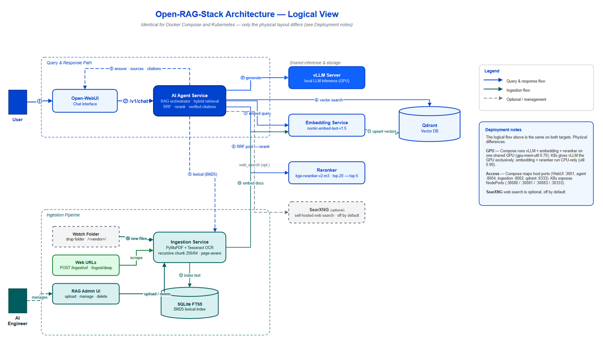

# open-RAG-stack


A self-hosted Retrieval-Augmented Generation (RAG) stack running on Kubernetes. Ingest your own documents, query them through a custom AI agent backed by a local LLM, and chat through Open-WebUI — entirely air-gapped if needed.

## Why this stack?

- **Fully self-hosted** — every component (LLM, embeddings, vector DB, agent, UI) runs in your cluster. No data leaves your network; it can run air-gapped.
- **Modular** — swap the LLM, embedding model, or web-search provider by editing `values.yaml` and one config block. Nothing is hardwired to a vendor.
- **Deploys anywhere** — plain Helm (`deploy/install.sh`) stands the whole stack up on any Kubernetes cluster. No GitOps controller required, though you can point one at the charts if you prefer.

### Cost comparison

Cloud AI APIs bill per token and per seat. A small team using document search and internal Q&A accumulates costs quickly:

| Capability | Hosted service | Typical cost | open-RAG-stack |
|---|---|---|---|
| LLM inference | OpenAI GPT-4o | ~$5–$15/1M tokens | Local vLLM — $0/token after hardware |
| Vector database | Pinecone Starter | ~$70/month | Qdrant self-hosted — free |
| Document ingestion | Azure AI Document Intelligence | ~$0.01/page | Self-hosted — free |
| Chat UI | ChatGPT Team | ~$25/user/month | Open-WebUI self-hosted — free |
| Data privacy | Hosted APIs process your data on vendor infrastructure | Compliance risk | Air-gapped — your data never leaves |

**Hardware cost:** a single used RTX 3090 (24 GB VRAM) runs 7B–14B parameter models comfortably and is typically available for $600–$900. At $200–$500/month in avoided API costs, it pays for itself in a few months — and the inference cost per query is effectively zero thereafter.

> This stack is not a replacement for managed services in every scenario. If you need guaranteed SLAs, global scale, or have no GPU hardware, a managed API is likely the right call. But for a small-to-medium team processing internal documents on predictable workloads, self-hosted is often the better economic choice.

## Quick start at a glance

```bash
export NODE_IP=<your-gpu-node-ip>
./scripts/prereq-check.sh --gpu-node <your-node-hostname>  # validate cluster, GPU, storage, egress
./scripts/bootstrap.sh                                     # interactive: prompts for secrets, then deploys via Helm
# wait for pods — vLLM takes a few minutes to load the model (watch: kubectl get pods -A -w)
./scripts/link-scrape.sh https://docs.anthropic.com   # then answer the collection/vendor prompts
./scripts/rag-query.sh "What is Claude?"
```

See [Quick start](#quick-start) below for the full, step-by-step version (model selection, web search, storage).

## Architecture



<details>
<summary>Text version of the diagram</summary>

```
Query & response path
  User → Open-WebUI (:30080) → ai-agent (:30081)
  ai-agent runs hybrid retrieval:
    • embed query         → embedding service   (:30082, nomic-embed-text-v1.5)
    • vector search       → Qdrant              (:30333)
    • lexical search BM25 → ingestion SQLite FTS5 (:30083)
    • fuse (RRF) + rerank → reranker            (:30084, bge-reranker-v2-m3) → top-5
    • generate answer     → vLLM                (:30000, local LLM)
  ai-agent → Open-WebUI: answer + sources + verified citations
  optional: web_search   → SearXNG             (:8080, off by default)

Ingestion pipeline
  Sources: Watch folder (drop) · Web URLs (/ingest, /ingest/deep) · RAG Admin UI (:8005)
    → ingestion service (:30083): PyMuPDF + Tesseract OCR, recursive chunk 256/64, page-aware
        → embedding service → Qdrant      (vector index)
        → SQLite FTS5                     (BM25 lexical index)

Logical flow is identical for Docker Compose and Kubernetes; only the physical
layout differs (GPU sharing, host ports vs NodePorts). See the diagram's
"Deployment notes" box.
```

</details>

### Request flow

1. User sends a message in **Open-WebUI**
2. Open-WebUI forwards it to **ai-agent** via the OpenAI-compatible `/v1/chat/completions` endpoint
3. ai-agent decides which tool to call:
   - `rag_search` — hybrid retrieval: embeds the query and runs vector search (Qdrant) + lexical BM25 search (SQLite FTS5) across all collections, fuses the two with RRF into a top-20 pool, then reranks via cross-encoder to top-5 (optional query rewriting is off by default — see `docs/ENHANCEMENT-PLAN.md`)
   - `web_search` — calls your configured web search provider (Brave, SearXNG, Serper, or Tavily)
4. Tool results are injected back into the LLM context
5. **vllm-server** generates the final response
6. ai-agent returns the answer plus a `sources` list to Open-WebUI

### Ingestion flow

```
URL or file  →  ingestion service  →  embedding service  →  Qdrant
               (scrape + chunk)       (nomic-embed-text)   (vector store)
```

Use `scripts/link-scrape.sh` to ingest a URL, or POST directly to the ingestion API.

---

## Services

| Service | Image | Port | Description |
|---|---|---|---|
| `open-webui` | `ghcr.io/open-webui/open-webui` | 30080 | Chat UI |
| `ai-agent` | `ghcr.io/benwold-lgtm/open-rag-ai-agent` | 30081 | RAG agent — calls vLLM + Qdrant |
| `embedding` | `ghcr.io/benwold-lgtm/open-rag-embedding` | 30082 | Embedding service (nomic-embed-text-v1.5) |
| `ingestion` | `ghcr.io/benwold-lgtm/open-rag-ingestion` | 30083 | Document ingestion pipeline |
| `reranker` | `ghcr.io/benwold-lgtm/open-rag-reranker` | 30084 | Cross-encoder reranker (BAAI/bge-reranker-v2-m3) |
| `vllm-server` | `vllm/vllm-openai` | 30000 | LLM inference (OpenAI-compatible) |
| `qdrant` | `qdrant/qdrant` | 30333 | Vector database |

---

## Prerequisites

- Kubernetes cluster (tested on bare-metal k8s — kubeadm, k3s, or similar; k3s includes `local-path` out of the box)
- A GPU node with NVIDIA drivers and the [NVIDIA device plugin](https://github.com/NVIDIA/k8s-device-plugin) installed
- Sufficient local disk on the GPU node for model weights (10–30 GB per model; 500 Gi allocated by default)
- `kubectl` and `helm` configured on your admin host
- A [Hugging Face](https://huggingface.co/) account and access token for model download

### Resource expectations

These are the defaults baked into the charts — tune them in each `values.yaml` for your hardware.

| Component | GPU | CPU (req/limit) | RAM (req/limit) | Storage |
|---|---|---|---|---|
| vLLM server | 1 × 24 GB GPU (RTX 3090/4090-class); `0.90` GPU-mem util | 4 / 8 | 16 Gi / 32 Gi (+16 Gi shared mem) | 500 Gi local-path (model weights) |
| embedding | optional (uses GPU if present, else CPU) | 2 / 8 | 4 Gi / 24 Gi | — |
| qdrant | — | 0.25 / 1 | 0.5 Gi / 2 Gi | 50 Gi local-path |
| ingestion | — | 0.5 / 2 | 1 Gi / 6 Gi | 5 Gi local-path |
| open-webui | — | — | — | 5 Gi local-path |
| ai-agent | — | 0.25 / 0.5 | 0.25 Gi / 0.5 Gi | — |

In practice: a single GPU node with a **24 GB card**, ~**32–48 GB system RAM**, and ~**560 Gi free local disk** runs the whole AI stack. All persistent storage uses the `local-path` provisioner — no NFS or external storage required. The control-plane/worker VMs that host Qdrant, ingestion, and Open-WebUI are lightweight by comparison.

---

## Before you deploy

A few decisions to make up front — each maps to a value you'll set during configuration:

- **LLM + where it runs** — by default, vLLM serves a Hugging Face model locally on your GPU. Alternatively, point `ai-agent` at any OpenAI-compatible endpoint (another host or a hosted API) via `VLLM_BASE_URL`. Either way, decide the model ID.
- **Embedding model** — defaults to `nomic-embed-text-v1.5` (768 dims). If you change it, update `ingestion` `embeddingDim` to match.
- **Web search provider** — pick one (Brave, SearXNG, Serper, Tavily) or none. All but SearXNG need an API key; RAG search over your own documents works without any.
- **Vector DB API key** — you choose the `QDRANT_API_KEY` value at bootstrap (any string).
- **Storage** — local disk on the GPU node. All charts use the `local-path` StorageClass (installed by bootstrap if not present). No NFS required.
- **GPU node + access IP** — the node hostname for `nodeSelector`, and its IP (`NODE_IP`) for NodePort access.
- **Container images** — use the project's published `open-rag-*` images, or fork and let CI build your own.

---

## Quick start

### 1. Configure values

Edit each chart's `values.yaml` before deploying. At minimum:

**`ai-stack/charts/vllm-server/values.yaml`**
```yaml
model:
  name: "mistralai/Mistral-7B-Instruct-v0.3"   # or any HF model on Hugging Face

nodeSelector:
  kubernetes.io/hostname: your-gpu-node
```

**`ai-stack/charts/ai-agent/values.yaml`**
```yaml
vllm:
  baseUrl: "http://<gpu-node-ip>:30000/v1"
  model: "mistralai/Mistral-7B-Instruct-v0.3"

nodeSelector:
  kubernetes.io/hostname: your-gpu-node
```

Repeat `nodeSelector` for `embedding`, `ingestion`, `qdrant`, and `open-webui` charts.

### 2. Configure web search (optional)

In `ai-stack/services/ai-agent/main.py`, uncomment your chosen provider in the **Web Search Provider** section. Options:

- **Brave Search** — `BRAVE_API_KEY` env var, set via Kubernetes secret
- **SearXNG** — self-hosted, no API key required; set `SEARXNG_URL`
- **Serper** — `SERPER_API_KEY` env var
- **Tavily** — `TAVILY_API_KEY` env var

### 3. Bootstrap the cluster

```bash
# Set your environment
export NODE_IP=192.168.1.x          # GPU node IP

# Run bootstrap: installs local-path-provisioner, creates namespaces + secrets,
# then deploys every service with Helm.
./scripts/bootstrap.sh
```

The bootstrap script will interactively prompt for:
- `WEB_SEARCH_API_KEY` — leave blank if using SearXNG
- `QDRANT_API_KEY` — any string you choose
- `HF_TOKEN` — your Hugging Face access token
- `ghcr-pull-secret` (optional) — only if your GHCR images are private

### 3b. Qwen3 advanced mode (optional)

The default vLLM deployment runs any standard HuggingFace model cleanly. If you are running **Qwen3 on a single RTX 3090** and want to enable MTP speculative decoding + Genesis memory patches, flip the opt-in flag in `ai-stack/charts/vllm-server/values.yaml`:

```yaml
patches:
  enabled: true
```

This adds an `initContainer` that clones the Genesis and recipe patch repos, pins to a tested nightly image digest, and applies Qwen3-specific flags (`--reasoning-parser qwen3`, `--quantization auto_round`, `--kv-cache-dtype fp8_e5m2`, etc.). Leave `enabled: false` for all other models.

### 4. Deploy the services

`bootstrap.sh` deploys everything for you on its final step. If you change a chart or a `values.yaml` later, re-deploy with the same idempotent Helm script:

```bash
./deploy/install.sh
```

This runs `helm upgrade --install` for each service into its namespace — no GitOps controller required, so it works on any Kubernetes cluster.

**Using a GitOps tool instead?** The Helm charts under `ai-stack/charts/<service>/` are the deployable unit. Point ArgoCD, Flux, or Rancher Fleet at them and let your controller manage the rollout — you don't need `deploy/install.sh` in that case.

### 5. Verify everything is running

Once pods are `Running` (`kubectl get pods -A`), confirm each service responds. Set `NODE_IP` to your GPU node's IP:

```bash
export NODE_IP=<your-gpu-node-ip>

curl -s -o /dev/null -w "open-webui  %{http_code}\n"  http://$NODE_IP:30080
curl -s -o /dev/null -w "vllm        %{http_code}\n"  http://$NODE_IP:30000/health
curl -s -o /dev/null -w "embedding   %{http_code}\n"  http://$NODE_IP:30082/health
curl -s -o /dev/null -w "ingestion   %{http_code}\n"  http://$NODE_IP:30083/health
curl -s -o /dev/null -w "ai-agent    %{http_code}\n"  http://$NODE_IP:30081/health
curl -s -o /dev/null -w "qdrant      %{http_code}\n"  http://$NODE_IP:30333/
```

Every service should return `200`. If a service returns `000` or nothing, check its pod logs with the matching script in `scripts/` (e.g. `./scripts/vllm-log.sh`).

---

## Forking this repo

If you fork this repo and want the CI to build and push images to your own GHCR namespace:

1. Fork to your GitHub account.
2. Push a commit to `main` — the three `build-*.yml` workflows authenticate with the built-in `GITHUB_TOKEN` (no secret setup required) and push `ghcr.io/<your-username>/open-rag-ai-agent`, `open-rag-embedding`, and `open-rag-ingestion`.
3. Update `image.repository` in each chart's `values.yaml` to point to your GHCR namespace.

**Making packages public (optional but simpler):** After the first CI run, go to each package on your GitHub profile → Change visibility → Public. This allows Kubernetes to pull without a pull secret.

---

## Ingesting documents

Documents are grouped into **collections** and tagged with a **vendor**. The agent searches across all collections at query time. There are four ways to get content in.

### 1. Scrape a single page or crawl a whole site

```bash
# Ingest a single URL
./scripts/link-scrape.sh https://docs.example.com/page

# Deep crawl — follows links to scrape an entire site
# (prompts for max depth, max pages, and an optional URL-pattern filter)
./scripts/link-scrape.sh https://docs.example.com --deep
```

### 2. Scrape many URLs at once (batch)

POST a list of URLs to `/ingest/batch`. Each entry sets its own collection and vendor, so one call can populate multiple collections:

```bash
curl -X POST http://<your-gpu-node-ip>:30083/ingest/batch \
  -H "Content-Type: application/json" \
  -d '{
    "documents": [
      {"url": "https://blogs.nvidia.com/blog/enterprise-reference-architectures/", "collection": "nvidia-ai-factory", "vendor": "NVIDIA"},
      {"url": "https://docs.nvidia.com/enterprise-reference-architectures/index.html", "collection": "nvidia-ai-factory", "vendor": "NVIDIA"},
      {"url": "https://www.dell.com/en-us/blog/how-dell-makes-the-ai-factory-real/", "collection": "dell-ai-factory", "vendor": "Dell"},
      {"url": "https://www.dell.com/en-us/blog/securing-the-ai-factory/", "collection": "dell-ai-factory", "vendor": "Dell"}
    ]
  }'
```

`access_roles` (default `["all"]`) and `classification` (default `"public"`) can be set per document but are optional.

### 3. Upload a file (PDF, txt, or md)

```bash
curl -X POST http://<your-gpu-node-ip>:30083/ingest/document \
  -F "file=@./whitepaper.pdf" \
  -F "collection=nvidia-ai-factory" \
  -F "vendor=NVIDIA"
```

### 4. Drop files into a watch folder

Enable `watchDir` in `ai-stack/charts/ingestion/values.yaml` and point `hostPath` at a directory on the node. Files placed in `<watchDir>/<vendor>/` are ingested automatically — the subfolder name becomes both the vendor tag and the collection. Processed files move to a `processed/` subfolder.

### Interactive API (no UI required)

The ingestion service is a FastAPI app, so it serves a browser-based Swagger UI at:

```
http://<your-gpu-node-ip>:30083/docs
```

From there you can fill in and POST to `/ingest/url`, `/ingest/batch`, `/ingest/deep`, and `/ingest/document` without writing curl by hand. (Open-WebUI is the chat front-end for *querying* — it does not handle ingestion.)

### Check status and query

```bash
# List recent ingestion jobs (or pass a doc_id for detail)
./scripts/ingest-status.sh

# Query the agent from the CLI
./scripts/rag-query.sh "What is an AI factory reference architecture?"
```

---

## Repository structure

```
open-RAG-stack/
├── .github/workflows/        # CI: build & push Docker images to ghcr.io
├── ai-stack/
│   ├── charts/               # Helm charts — one per service
│   │   ├── ai-agent/
│   │   ├── embedding/
│   │   ├── ingestion/
│   │   ├── open-webui/
│   │   ├── qdrant/
│   │   └── vllm-server/
│   └── services/             # Python microservice source
│       ├── ai-agent/         # RAG agent (FastAPI)
│       ├── embedding/        # Embedding service (FastAPI)
│       └── ingestion/        # Ingestion pipeline (FastAPI)
├── deploy/                   # install.sh — Helm deploy/upgrade for all services
├── docs/                     # Architecture diagram (.drawio source + .png)
├── scripts/                  # Helper scripts — see Scripts reference below
└── LICENSE                   # MIT
```

---

## Scripts reference

All scripts live in `scripts/` (except `install.sh`, which is in `deploy/`). The ingest/query/log scripts honour `NODE_IP`, `INGESTION_URL`, and `AI_AGENT_URL` environment variables so you can point them at your cluster without editing files.

| Script | Purpose |
|---|---|
| `scripts/prereq-check.sh` | Validate prerequisites before bootstrap (cluster, GPU, storage, egress) |
| `scripts/bootstrap.sh` | One-time setup: storage classes, namespaces, secrets, then deploys the stack |
| `deploy/install.sh` | Deploy or upgrade all services via Helm (idempotent; re-run after editing charts/values) |
| `scripts/RAG-startup.sh` | Scale the whole stack back to 1 replica (resume after shutdown) |
| `scripts/RAG-shutdown.sh` | Scale the whole stack to 0 to free GPU and RAM (storage/secrets untouched) |
| `scripts/status.sh` | Pod overview across all stack namespaces |
| `scripts/link-scrape.sh` | Ingest a URL — single page or `--deep` site crawl |
| `scripts/ingest-status.sh` | List recent ingestion jobs, or inspect one by `doc_id` |
| `scripts/rag-query.sh` | Send a question to the agent from the CLI |
| `scripts/ai-agent-log.sh` | Tail ai-agent logs |
| `scripts/embedding-log.sh` | Tail embedding logs |
| `scripts/ingestion-log.sh` | Tail ingestion logs |
| `scripts/qdrant-log.sh` | Tail Qdrant logs |
| `scripts/vllm-log.sh` | Tail vLLM server logs |

---

## Hardening for production use

The defaults in this repo are designed for getting started quickly. Before putting this stack in front of employees or on a network that isn't fully trusted, consider the following.

### Authentication

Open-WebUI ships with `auth.enabled: true` by default. The first user to register becomes the admin. Subsequent users require admin approval. Do not disable auth on any network where the NodePort is reachable by untrusted devices.

### Network isolation (NetworkPolicies)

By default, every pod can reach every other pod in the cluster. For a business deployment, lock down inter-service traffic to only the paths that are needed:

```bash
# Deny all ingress by default in each namespace, then allow only required paths.
# Apply this pattern to each namespace (example for the qdrant namespace):
kubectl apply -f - <<EOF
apiVersion: networking.k8s.io/v1
kind: NetworkPolicy
metadata:
  name: default-deny-ingress
  namespace: qdrant
spec:
  podSelector: {}
  policyTypes:
    - Ingress
---
apiVersion: networking.k8s.io/v1
kind: NetworkPolicy
metadata:
  name: allow-from-ai-agent
  namespace: qdrant
spec:
  podSelector:
    matchLabels:
      app: qdrant
  ingress:
    - from:
        - namespaceSelector:
            matchLabels:
              kubernetes.io/metadata.name: ai-agent
        - namespaceSelector:
            matchLabels:
              kubernetes.io/metadata.name: ingestion
EOF
```

Repeat the `default-deny-ingress` pattern for all namespaces (`ai-agent`, `embedding`, `ingestion`, `ai-stack`, `open-webui`), then add explicit `allow-from-*` policies for each required connection. Refer to the [Architecture](#architecture) diagram for the exact call paths.

### Pod security

Add a `securityContext` to each deployment to prevent pods from running as root:

```yaml
securityContext:
  runAsNonRoot: true
  runAsUser: 1000
  allowPrivilegeEscalation: false
```

This can be added to the `spec.template.spec` section of each chart's `templates/deployment.yaml`.

### Secrets at rest

The bootstrap script creates plain Kubernetes Secrets (base64-encoded, not encrypted). If your cluster does not have [encryption at rest](https://kubernetes.io/docs/tasks/administer-cluster/encrypt-data/) enabled, consider using an external secrets manager (Vault, AWS Secrets Manager, Azure Key Vault) via the [External Secrets Operator](https://external-secrets.io/).

---

## Troubleshooting

**vLLM pod stays in `Pending`**
- Check that the NVIDIA device plugin is installed: `kubectl get pods -n kube-system | grep nvidia`
- Verify the node has a GPU resource: `kubectl describe node <your-gpu-node> | grep nvidia.com/gpu`
- Confirm `nodeSelector` in `vllm-server/values.yaml` matches the node's hostname exactly.

**vLLM pod crashes on startup**
- Check logs: `kubectl logs -n ai-stack deploy/vllm-server --previous`
- If you have `patches.enabled: true`, confirm the patch repos are reachable from your cluster (requires internet egress).
- For a standard model (Mistral, Llama, etc.) leave `patches.enabled: false` — the clean startup path is the default.

**PVC stays in `Pending`**
- Confirm `local-path` StorageClass is installed: `kubectl get storageclass local-path`
- If missing, run: `kubectl apply -f https://raw.githubusercontent.com/rancher/local-path-provisioner/master/deploy/local-path-storage.yaml`
- Check provisioner logs: `kubectl logs -n local-path-storage -l app=local-path-provisioner`
- Confirm the node has enough free disk space: `df -h` on the GPU node. The vLLM PVC requests 500 Gi by default.

**Images fail to pull (`ErrImagePull` / `ImagePullBackOff`)**
- GHCR packages are private by default. Either make them public (see [Forking this repo](#forking-this-repo)) or run bootstrap.sh and choose `y` when prompted to create `ghcr-pull-secret`.

**Qdrant pod has no API key / RAG queries return 401**
- Confirm `qdrant-secrets` exists in the `qdrant` namespace: `kubectl get secret qdrant-secrets -n qdrant`
- If missing, run bootstrap.sh again — it skips existing secrets so re-running is safe.

**Open-WebUI shows no models**
- Confirm ai-agent is running: `kubectl get pods -n ai-agent`
- Check the `vllm.baseUrl` in `open-webui/values.yaml` points to ai-agent's cluster DNS, not directly to vLLM.
- Open-WebUI requires login by default (`auth.enabled: true`). The first user to register becomes admin; subsequent users require admin approval.

### Common gotchas

- **Embedding dimension must match the model.** `ingestion` `embeddingDim` defaults to `768` for `nomic-embed-text-v1.5`. If you swap the embedding model, update `embeddingDim` to the new model's dimension *and re-ingest* — a mismatch makes every search silently return nothing.
- **NodePorts must be unique.** Check the [NodePort table](#services) before adding a service; a duplicate port makes the new Service fail to create.
- **vLLM flags are model-specific.** The default deployment is clean — no extra parsers or quantization flags. If you set `patches.enabled: true`, those settings are Qwen3-specific and will break tool calling on other models.
- **Collection and vendor names are case-sensitive.** `Cisco` and `cisco` are different collections; keep them consistent between ingestion and querying.
- **`pullPolicy: Always` + private images.** If your `open-rag-*` packages are private, pods will `ImagePullBackOff` until you add `ghcr-pull-secret` or make the packages public.

---

## Secrets reference

All secrets are created by `scripts/bootstrap.sh` and stored in Kubernetes — nothing is committed to the repo.

| Secret name | Namespace | Keys | Purpose |
|---|---|---|---|
| `ai-agent-secrets` | `ai-agent` | `BRAVE_API_KEY`, `QDRANT_API_KEY` | Web search + Qdrant auth for ai-agent |
| `qdrant-secrets` | `qdrant` | `QDRANT_API_KEY` | Qdrant API key |
| `hf-token-secret` | `ai-stack` | `token` | Hugging Face token for vLLM model download |
| `ghcr-pull-secret` | `ingestion` | Docker config | Pull custom images from ghcr.io |
